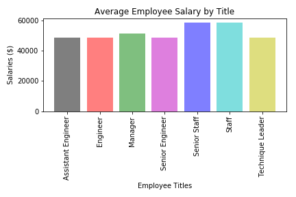
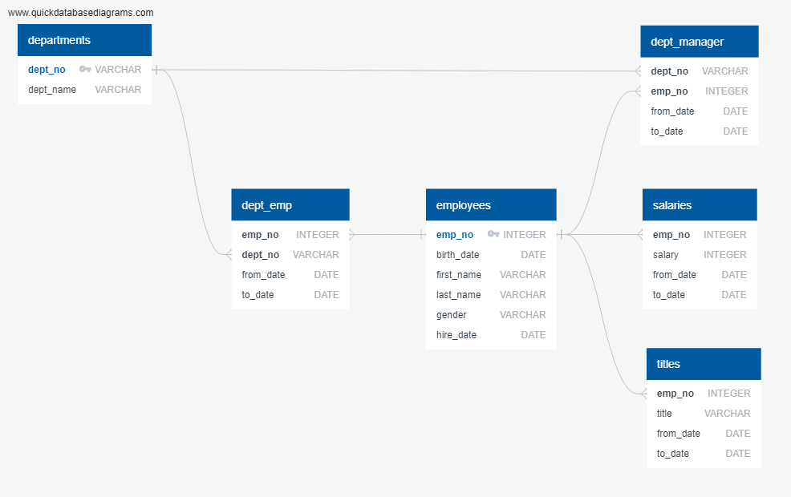

# SQL

### Objectives

#### Data Modeling
Inspect the six CSVs with employee data and sketch out an ERD of the tables.

#### Data Engineering
* Create a table schema for each of the six CSV files. Specify data types, primary keys, foreign keys, and other constraints.
* Import each CSV file into the corresponding SQL table.

#### Data Analysis
Once database is complete, do the following using SLQ queries:

* List the following details of each employee: employee number, last name, first name, gender, and salary.
* List employees who were hired in 1986.
* List the manager of each department with the following information: department number, department name, the manager's employee number, last name, first name, and start and end employment dates.
* List the department of each employee with the following information: employee number, last name, first name, and department name.
* List all employees whose first name is "Hercules" and last names begin with "B."
* List all employees in the Sales department, including their employee number, last name, first name, and department name.
* List all employees in the Sales and Development departments, including their employee number, last name, first name, and department name.
* In descending order, list the frequency count of employee last names, i.e., how many employees share each last name.

#### SQLAlchemy
* Import the SQL database into Pandas.
* Create a bar chart of average salary by title.

